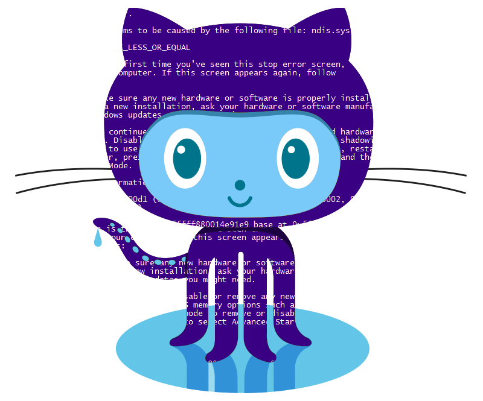

<h2 align="center"> Hello! I'm Guilherme Trevisan</h2>

  &nbsp;
  &nbsp;
  &nbsp;
  &nbsp;
  

<h2 align="left">&#x1F680; Active Open Source Projects</h2>

<table>
  <thead>
    <tr>
      <th align="center">Project</th>
      <th align="center">Stars</th>
      <th align="center">Forks</th>
      <th align="center">Issues</th>
      <th align="center">Pull requests</th>
    </tr>
  </thead>
  <tbody>
    <tr>
      <td align="center" valign="middle"><a href="https://github.com/TrevisanGMW/gt-tools">GT Tools</a></td>
      <td align="center" valign="middle"></td>
      <td align="center" valign="middle"></td>
      <td align="center" valign="middle"></td>
      <td align="center" valign="middle"></td>
    </tr>
  </tbody>
</table>

<h2 align="left">&#x1F528; Technologies & Tools</h2>

  
  
  
  
  
  
  
  
  
  
  

  
  
  
  
  
  
  
  
  

  

